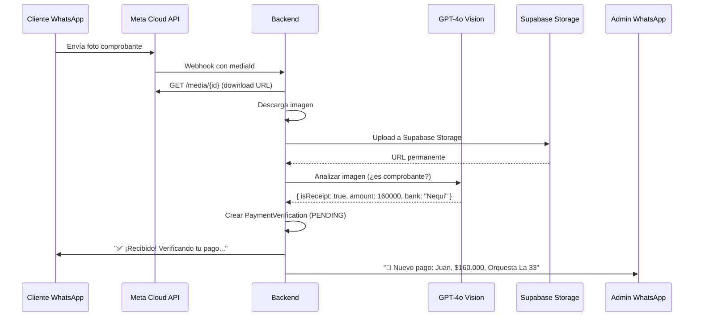

# ERS — Chatbot: Flujo de Reservas, Pagos y Verificación Visual
**Versión:** 1.0 · **Fecha:** 25 Mar 2026 · **Proyecto:** Pachanga y Pochola
**Tipo:** Extensión del módulo Chatbot existente (ERS_chatbot_whatsapp.md)

---

## 1. Resumen Ejecutivo

**Problema:** El chatbot actual solo orienta al cliente y le da un link para reservar en la web. Cuando un cliente quiere comprar boletas para un evento o reservar VIP, debe salir de WhatsApp, buscar datos bancarios, hacer la consignación, y luego no tiene forma de confirmar el pago por WhatsApp.

**Solución:** Extender el chatbot para que:
1. Gestione el flujo completo de compra/reserva **dentro de WhatsApp**.
2. Suministre automáticamente los datos bancarios para consignación.
3. Detecte fotos de comprobantes de pago usando **GPT-4 Vision**.
4. Notifique al administrador con los datos del pago para verificación manual.
5. Confirme al cliente que su pago está siendo procesado.

**Valor de negocio:** Convierte el chatbot de un simple FAQ en un **canal de ventas**. Los clientes pueden comprar boletas y reservar sin salir de WhatsApp, reduciendo la fricción y aumentando las conversiones.

---

## 2. Flujo Principal — Compra de Boletas / Reserva VIP

```
Cliente: "Quiero ir al concierto del sábado"
Bot: "¡Claro! 🎶 Este sábado tenemos:
      🎤 Orquesta La 33 — Sábado 29 de Marzo
      💰 Cover: $40.000 (general) / $120.000 (VIP con botella)
      👥 ¿Para cuántas personas?"

Cliente: "Para 4 personas, general"
Bot: "¡Perfecto! 4 entradas generales = $160.000 COP
      
      📍 Para reservar, haz la consignación a:
      🏦 Bancolombia — Ahorros #XXX-XXX-XXXXX
      👤 A nombre de: [Nombre Titular]
      💵 Monto: $160.000
      📝 Referencia: PACH-290326-4G
      
      Cuando hagas el pago, envíame la foto del comprobante 📸"

Cliente: [envía foto del comprobante de Nequi]
Bot: "✅ ¡Recibido! Estamos verificando tu pago.
      Te confirmo en unos minutos. 🙏"

→ Notificación al admin:
  "🔔 PAGO RECIBIDO
   Cliente: Juan Pérez (+573124183002)
   Evento: Orquesta La 33 — 29 Mar
   Monto esperado: $160.000
   Ref: PACH-290326-4G
   [Ver comprobante]"
```

---

## 3. Requisitos Funcionales

### RF-01: Intención PURCHASE (Nueva)

| Intención | Trigger | Respuesta |
|---|---|---|
| `PURCHASE` | "Quiero comprar boletas", "¿Cómo pago la entrada?" | Flujo de compra guiado |

- **REQ-01:** El sistema DEBERÁ detectar la intención `PURCHASE` cuando el cliente exprese deseo de comprar boletas, entradas, o reservar VIP para un evento.
- **REQ-02:** El sistema DEBERÁ diferenciar `PURCHASE` (quiere pagar ahora) de `RESERVATION` (quiere reservar mesa sin pago anticipado).

---

### RF-02: Flujo Conversacional de Compra (Multi-Step)

```
Estado IDLE → COLLECTING_EVENT → COLLECTING_QUANTITY → AWAITING_PAYMENT → VERIFYING → CONFIRMED/REJECTED
```

- **REQ-03:** El sistema DEBERÁ implementar un flujo conversacional con estados, almacenados en `ChatConversation.metadata`.
- **REQ-04:** Los estados del flujo son:

| Estado | Descripción | Siguiente paso |
|---|---|---|
| `IDLE` | Sin flujo activo | Detectar intención |
| `COLLECTING_EVENT` | Preguntando qué evento | Mostrar eventos disponibles |
| `COLLECTING_QUANTITY` | Preguntando cuántas personas/tipo | Calcular total |
| `AWAITING_PAYMENT` | Datos bancarios enviados, esperando comprobante | Detectar imagen |
| `VERIFYING_PAYMENT` | Comprobante recibido, admin notificado | Admin confirma/rechaza |
| `CONFIRMED` | Pago verificado | Enviar confirmación |

- **REQ-05:** El flujo DEBERÁ persistir entre mensajes (multi-turno) y expirar después de 2 horas de inactividad.

---

### RF-03: Datos Bancarios Configurables

- **REQ-06:** Los datos bancarios DEBERÁN almacenarse en `ChatbotKnowledge` con categoría `payment_info`:

| Key | Valor ejemplo |
|---|---|
| `bank_name` | Bancolombia |
| `account_type` | Ahorros |
| `account_number` | XXX-XXX-XXXXX |
| `account_holder` | Nombre del titular |
| `nequi_number` | 3XX XXX XXXX |
| `daviplata_number` | 3XX XXX XXXX |

- **REQ-07:** El admin DEBERÁ poder editar los datos bancarios desde el dashboard sin tocar código.
- **REQ-08:** El bot DEBERÁ generar una **referencia única** por transacción (formato: `PACH-DDMMYY-NX`) para facilitar la verificación.

---

### RF-04: Detección de Comprobantes de Pago (GPT Vision)

- **REQ-09:** El sistema DEBERÁ procesar imágenes entrantes usando **OpenAI GPT-4o Vision** cuando la conversación esté en estado `AWAITING_PAYMENT`.
- **REQ-10:** El análisis de imagen DEBERÁ determinar:

| Campo | Qué buscar |
|---|---|
| `isPaymentReceipt` | ¿Es un comprobante bancario/Nequi/Daviplata? (bool) |
| `amount` | Monto detectado en la imagen |
| `date` | Fecha de la transacción |
| `reference` | Número de referencia/aprobación |
| `bank` | Entidad bancaria detectada |

- **REQ-11:** Si la imagen NO es un comprobante, el bot DEBERÁ responder: "Esa imagen no parece ser un comprobante de pago. Por favor envíame la captura de pantalla de tu transferencia 📸"
- **REQ-12:** Si la imagen SÍ es un comprobante, el sistema DEBERÁ almacenar la URL de la imagen y los datos extraídos.

---

### RF-05: Almacenamiento de Imágenes

- **REQ-13:** Las imágenes de comprobantes DEBERÁN descargarse de Meta (URL temporal de 7 días) y subirse a **Supabase Storage** (bucket `payment-receipts`).
- **REQ-14:** La URL permanente de Supabase DEBERÁ almacenarse en el modelo `PaymentVerification`.

---

### RF-06: Notificación al Administrador

- **REQ-15:** Al recibir un comprobante válido, el sistema DEBERÁ enviar un **WhatsApp al admin** (+573124183002) con:
  - Nombre y teléfono del cliente
  - Evento y tipo de entrada
  - Monto esperado vs. monto detectado en el comprobante
  - Referencia de transacción
  - Link al comprobante en Supabase Storage
- **REQ-16:** El admin DEBERÁ poder **confirmar o rechazar** el pago desde el dashboard admin.
- **REQ-17:** Al confirmar, el bot DEBERÁ enviar al cliente: "✅ ¡Tu pago ha sido verificado! Estás confirmado para [evento]. ¡Te esperamos! 🎉"
- **REQ-18:** Al rechazar, el bot DEBERÁ enviar: "⚠️ No pudimos verificar tu pago. Por favor comunícate con nosotros para resolverlo."

---

### RF-07: Integración con Eventos Existentes

- **REQ-19:** El bot DEBERÁ consultar la tabla `Event` existente para:
  - Listar eventos próximos con nombre, fecha, precio
  - Verificar que el evento esté activo
  - Calcular el monto total basado en cantidad × precio del evento
- **REQ-20:** Si no hay eventos próximos, el bot DEBERÁ responder: "No tenemos eventos programados por ahora, pero síguenos en redes para enterarte primero 📲"

---

## 4. Modelo de Datos

### 4.1 Nuevo Modelo: `PaymentVerification`

```prisma
enum PaymentStatus {
  PENDING       // Comprobante recibido, esperando verificación
  CONFIRMED     // Admin confirmó el pago
  REJECTED      // Admin rechazó el pago
  EXPIRED       // Expiró sin verificación (48h)
}

model PaymentVerification {
  id              String        @id @default(uuid())
  customerId      String        @map("customer_id")
  customer        Customer      @relation(fields: [customerId], references: [id])
  conversationId  String        @map("conversation_id")
  conversation    ChatConversation @relation(fields: [conversationId], references: [id])
  
  // Transaction data
  eventId         String?       @map("event_id")
  event           Event?        @relation(fields: [eventId], references: [id])
  reference       String        @unique  // PACH-DDMMYY-NX
  expectedAmount  Int           @map("expected_amount")  // En COP
  ticketType      String        @map("ticket_type")  // "general", "vip"
  quantity        Int
  
  // Payment receipt (from GPT Vision)
  receiptUrl      String?       @map("receipt_url")  // Supabase Storage URL
  detectedAmount  Int?          @map("detected_amount")
  detectedBank    String?       @map("detected_bank")
  detectedDate    String?       @map("detected_date")
  detectedRef     String?       @map("detected_ref")
  
  // Verification
  status          PaymentStatus @default(PENDING)
  verifiedBy      String?       @map("verified_by")  // Admin user ID
  verifiedAt      DateTime?     @map("verified_at")
  rejectionReason String?       @map("rejection_reason")
  
  createdAt       DateTime      @default(now()) @map("created_at")
  updatedAt       DateTime      @updatedAt @map("updated_at")

  @@index([customerId])
  @@index([status])
  @@index([reference])
  @@map("payment_verifications")
}
```

### 4.2 Modificaciones a Modelos Existentes

| Modelo | Cambio |
|---|---|
| `ChatConversation` | Agregar campo `metadata Json?` para estado del flujo de compra |
| `Customer` | Agregar relación `paymentVerifications PaymentVerification[]` |
| `Event` | Agregar relación `paymentVerifications PaymentVerification[]` |
| `Event` | Agregar campo `ticketPrice Int?` si no existe |

---

## 5. Arquitectura — Flujo de Imagen



---

## 6. Módulos Backend (Nuevos/Modificados)

| Archivo | Responsabilidad | Estado |
|---|---|---|
| `chatbot/chatbot.purchase-flow.ts` | **[NEW]** Máquina de estados del flujo de compra |
| `chatbot/chatbot.vision.ts` | **[NEW]** Análisis de imágenes con GPT-4o Vision |
| `chatbot/chatbot.payment.ts` | **[NEW]** CRUD de PaymentVerification + referencia |
| `chatbot/chatbot.service.ts` | **[MODIFY]** Integrar flujo de compra + imágenes |
| `chatbot/chatbot.ai-engine.ts` | **[MODIFY]** Agregar intención PURCHASE al prompt |
| `chatbot/chatbot.controller.ts` | **[MODIFY]** Endpoints admin para verificar pagos |
| `whatsapp/whatsapp.controller.ts` | **[MODIFY]** Procesar mensajes tipo `image` |
| `lib/storage.ts` | **[MODIFY]** Agregar bucket `payment-receipts` |

---

## 7. Endpoints API Nuevos

| Método | Ruta | Descripción |
|---|---|---|
| `GET` | `/api/chatbot/payments` | Lista de pagos pendientes / histórico |
| `PATCH` | `/api/chatbot/payments/:id/confirm` | Admin confirma un pago |
| `PATCH` | `/api/chatbot/payments/:id/reject` | Admin rechaza un pago |
| `GET` | `/api/chatbot/payments/:id/receipt` | Ver imagen del comprobante |

---

## 8. Variables de Entorno Nuevas

```env
# No se necesitan nuevas — GPT-4o Vision usa la misma OPENAI_API_KEY
# Solo agregar a knowledge base: datos bancarios
```

---

## 9. Estimación de Costos Adicionales

| Concepto | Costo |
|---|---|
| GPT-4o Vision (análisis de comprobante, ~1 por compra) | ~$0.01-0.03 USD/imagen |
| Supabase Storage (imágenes de comprobantes) | Incluido en free tier (<1GB) |
| WhatsApp (notificación al admin = template message) | ~$0.05 USD/msg |
| **Estimado mensual** (50 compras/mes) | **~$4 USD/mes adicional** |

---

## 10. Fases de Implementación

### Fase 1 — Flujo de Compra Básico (Sprint 1)
- [ ] Modelo `PaymentVerification` + migración
- [ ] `chatbot.purchase-flow.ts` — máquina de estados
- [ ] Intención `PURCHASE` en el AI engine
- [ ] Datos bancarios en Knowledge Base
- [ ] Generación de referencia única
- [ ] Bot da datos bancarios y espera comprobante

### Fase 2 — Detección Visual de Pagos (Sprint 2)
- [ ] `chatbot.vision.ts` — integración GPT-4o Vision
- [ ] Procesar imágenes en webhook (descargar + subir a Supabase)
- [ ] Análisis del comprobante (¿es recibo? monto, banco, fecha)
- [ ] Notificación al admin por WhatsApp
- [ ] Panel admin: lista de pagos pendientes

### Fase 3 — Verificación y Confirmación (Sprint 3)
- [ ] Endpoints confirm/reject en admin
- [ ] Bot notifica al cliente del resultado
- [ ] Dashboard: historial de pagos con filtros
- [ ] Expiración automática de pagos no verificados (48h)
- [ ] Kimi: UI de verificación de pagos en admin panel

---

## 11. Criterios de Aceptación

- [ ] Cliente pregunta por evento → bot muestra eventos con precios
- [ ] Cliente dice "quiero 4 boletas" → bot calcula total y da datos bancarios
- [ ] Cliente envía foto de comprobante → bot la procesa y dice "recibido"
- [ ] Admin recibe WhatsApp con datos del pago + link al comprobante
- [ ] Admin confirma pago → cliente recibe confirmación por WhatsApp
- [ ] Si la imagen NO es comprobante → bot pide que envíe el correcto
- [ ] Datos bancarios son editables desde el admin panel
- [ ] Referencia de pago es única por transacción

---

## 12. Riesgos y Mitigaciones

| Riesgo | Mitigación |
|---|---|
| GPT Vision no reconoce bien comprobantes colombianos | Prompt detallado con ejemplos de Nequi/Bancolombia/Daviplata |
| Cliente envía foto borrosa | Bot pide reenviar con mejor calidad |
| Media de Meta expira en 7 días | Descargar y subir a Supabase inmediatamente |
| Fraude con comprobantes falsos | Verificación manual del admin obligatoria |
| Alto volumen de comprobantes satura admin | Badge con contador en dashboard + sonido de notificación |
