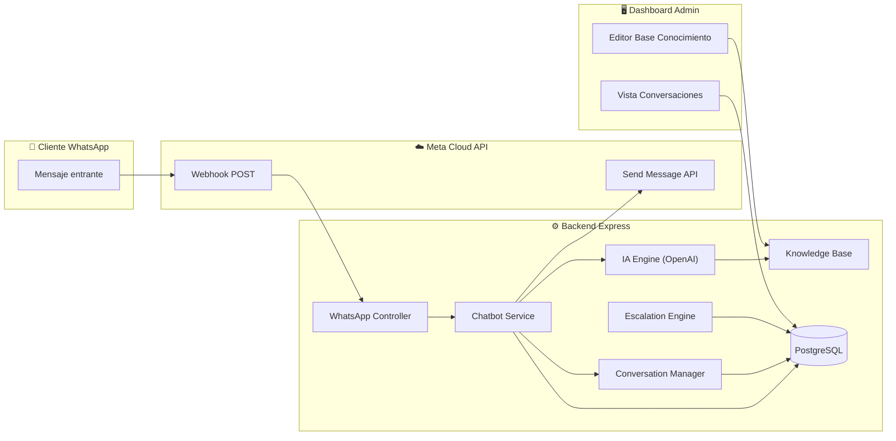
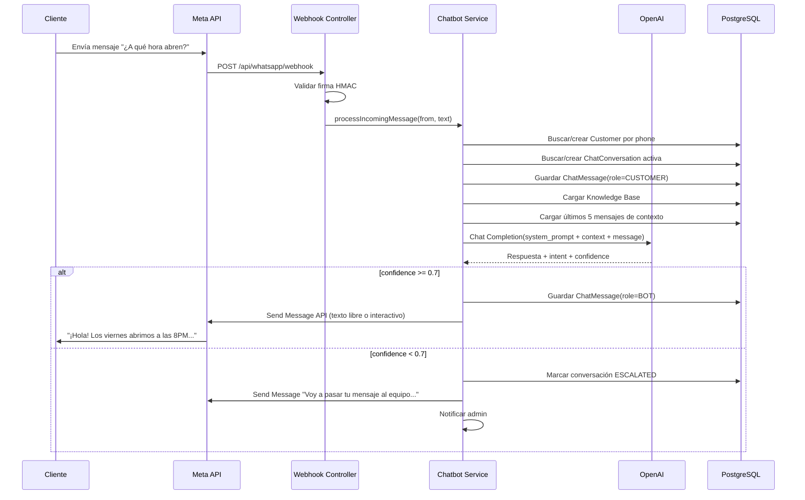

# ERS — Chatbot IA para WhatsApp: Atención Automática al Cliente
**Versión:** 1.0 · **Fecha:** 22 Mar 2026 · **Proyecto:** Pachanga y Pochola

---

## 1. Resumen Ejecutivo

**Problema:** Actualmente, al configurar WhatsApp Business API con Meta, el número queda vinculado a la plataforma Cloud API y **ya no puede usarse en la app WhatsApp de un celular**. Esto deja al dueño sin forma de ver ni responder manualmente los mensajes de los clientes que escriben al WhatsApp del negocio.

**Solución:** Un chatbot inteligente basado en IA que:
- Recibe y responde automáticamente los mensajes entrantes de los clientes vía WhatsApp Cloud API.
- Entiende contexto del negocio (horarios, precios, reservas, eventos, ubicación, menú).
- Escala a un humano cuando no puede resolver la consulta.
- Registra todas las conversaciones para análisis posterior.

**Valor de negocio:** El dueño recupera la capacidad de "atender" al cliente 24/7 sin necesidad de tener el WhatsApp en el celular. Las preguntas frecuentes (>80% del volumen) se resuelven automáticamente, y solo las consultas complejas se escalan vía notificación al admin.

---

## 2. Actores y Roles del Sistema

| Actor | Descripción |
|---|---|
| **Cliente (WhatsApp)** | Persona que escribe al número de WhatsApp de Pachanga para preguntar por horarios, precios, reservas, ubicación, eventos, etc. |
| **Chatbot IA** | Motor de IA que recibe mensajes entrantes, interpreta la intención y responde automáticamente con información del negocio. |
| **Admin (Dashboard)** | Dueño/operador que configura la base de conocimiento del bot, revisa conversaciones escaladas, y ajusta respuestas. |
| **Sistema Existente** | Backend Express actual con CRM, reservas, y WhatsApp Cloud API ya integrada. |

---

## 3. Requisitos Funcionales (Los "Must-Haves")

### RF-01: Recepción de Mensajes Entrantes

```
Given un cliente envía un mensaje de texto al WhatsApp del negocio
When Meta envía el webhook POST /api/whatsapp/webhook con el mensaje
Then el sistema:
  1. Identifica al cliente existente o crea un perfil temporal
  2. Clasifica la intención del mensaje con IA
  3. Genera una respuesta contextual
  4. Envía la respuesta vía WhatsApp Cloud API (mensaje interactivo o texto libre)
  5. Registra la conversación completa (pregunta + respuesta) en la BD
```

- **REQ-01:** El sistema DEBERÁ recibir mensajes de texto entrantes vía webhook de Meta y procesarlos en <3 segundos.
- **REQ-02:** El sistema DEBERÁ identificar al remitente buscando el `phone` en la tabla `Customer`. Si no existe, DEBERÁ crear un registro temporal con `source: WHATSAPP_CHAT`.
- **REQ-03:** El sistema DEBERÁ soportar mensajes de tipo `text`, `interactive` (respuestas a botones/listas) e `image` (con caption).

---

### RF-02: Motor de IA — Clasificación de Intenciones

```
Given un mensaje entrante como "¿A qué hora abren los viernes?"
When el motor de IA procesa el mensaje
Then clasifica la intención como "HORARIOS"
And genera la respuesta: "¡Hola! 🎶 Los viernes abrimos a las 8:00 PM y cerramos a las 3:00 AM. ¡Te esperamos! 🔥"
```

**Intenciones soportadas (MVP):**

| ID | Intención | Ejemplo de mensaje cliente | Tipo de respuesta |
|---|---|---|---|
| `GREETING` | Saludo | "Hola", "Buenas noches" | Bienvenida + menú de opciones |
| `HOURS` | Horarios | "¿A qué hora abren?" | Texto con horarios por día |
| `LOCATION` | Ubicación | "¿Dónde quedan?" "¿Cómo llego?" | Texto + link Google Maps |
| `PRICES` | Precios / Cover | "¿Cuánto cuesta la entrada?" | Texto con precios vigentes |
| `RESERVATION` | Reservar mesa | "Quiero reservar para 6" | Flujo guiado + link de reserva |
| `EVENTS` | Eventos / DJs | "¿Qué hay este sábado?" | Texto con eventos de la semana |
| `MENU` | Carta de licores | "¿Tienen whisky?" "¿Cuánto cuesta una botella?" | Texto con menú/precios |
| `BIRTHDAY` | Info cumpleaños | "¿Tienen promo de cumple?" | Texto con paquetes cumpleaños |
| `COMPLAINTS` | Quejas / reclamos | "El servicio fue pésimo" | Disculpa + escalar a admin |
| `UNKNOWN` | No identificable | Cualquier otra cosa | Respuesta amigable + escalar |

- **REQ-04:** El sistema DEBERÁ clasificar la intención del mensaje del cliente usando un modelo de IA (OpenAI GPT-4o-mini o equivalente) con **system prompt** inyectado con la base de conocimiento del negocio.
- **REQ-05:** El sistema DEBERÁ responder en **español informal** (tuteo colombiano), con emojis, manteniendo el tono de marca de Pachanga (fiesta, rumba, energía).
- **REQ-06:** El sistema DEBERÁ mantener contexto de conversación (últimos 5 mensajes) para respuestas coherentes en intercambios multi-turno.

---

### RF-03: Base de Conocimiento del Negocio

```
Given el admin quiere actualizar la info del bot
When accede a /admin/chatbot/knowledge
Then puede editar la base de conocimiento en formato clave-valor:
  - Horarios por día
  - Precios de cover y botellas
  - Ubicación y link Google Maps
  - Eventos de la semana
  - Paquetes de cumpleaños
  - Políticas (edad mínima, dress code, etc.)
  - Respuestas personalizadas para preguntas frecuentes
```

- **REQ-07:** El sistema DEBERÁ almacenar la base de conocimiento en la tabla `ChatbotKnowledge` con categorías y pares clave-valor editables desde el dashboard admin.
- **REQ-08:** El sistema DEBERÁ inyectar la base de conocimiento como contexto del system prompt de la IA en cada solicitud.
- **REQ-09:** Los cambios en la base de conocimiento DEBERÁN reflejarse inmediatamente (sin reiniciar el bot).

---

### RF-04: Mensajes Interactivos (Botones y Listas)

```
Given un cliente saluda con "Hola"
When el bot responde
Then envía un mensaje interactivo con botones:
  "¡Hola! 🎶 Soy el asistente de Pachanga y Pochola. ¿En qué te puedo ayudar?"
  [📅 Reservar Mesa]  [🕐 Horarios]  [📍 Ubicación]
```

- **REQ-10:** El sistema DEBERÁ usar la API de mensajes interactivos de Meta (botones y listas) cuando sea apropiado, no solo texto plano.
- **REQ-11:** El sistema DEBERÁ enviar máximo 3 botones por mensaje (límite de Meta) y listas de hasta 10 opciones.

---

### RF-05: Escalamiento a Humano

```
Given el bot recibe un mensaje que NO puede resolver (queja, solicitud especial, confuso)
When la confianza del modelo es < 70% o la intención es COMPLAINTS/UNKNOWN
Then el sistema:
  1. Responde al cliente: "Entiendo, voy a pasar tu mensaje a nuestro equipo. Te responderán pronto 🙏"
  2. Marca la conversación como ESCALATED
  3. Envía notificación al admin (push/email/webhook)
  4. El admin puede responder manualmente desde el dashboard
```

- **REQ-12:** El sistema DEBERÁ escalar automáticamente cuando la confianza de clasificación sea inferior al 70%  o cuando la intención sea `COMPLAINTS` o `UNKNOWN`.
- **REQ-13:** El sistema DEBERÁ notificar al admin de las conversaciones escaladas vía email y/o webhook a una URL configurable.
- **REQ-14:** El sistema DEBERÁ permitir al admin responder manualmente a conversaciones escaladas desde el dashboard, enviando el mensaje vía Cloud API.

---

### RF-06: Historial de Conversaciones

```
Given el admin navega a /admin/chatbot/conversations
When la página carga
Then ve una lista de conversaciones activas con:
  - Nombre/teléfono del cliente
  - Último mensaje
  - Estado (ACTIVE, ESCALATED, RESOLVED)
  - Timestamp
And puede abrir cualquier conversación para ver el historial completo
And puede filtrar por estado, fecha, intención
```

- **REQ-15:** El sistema DEBERÁ almacenar todo el historial de mensajes (entrantes y salientes) en la tabla `ChatMessage`.
- **REQ-16:** El sistema DEBERÁ proveer un endpoint paginado `GET /api/chatbot/conversations` con filtros por estado y fecha.
- **REQ-17:** El sistema DEBERÁ auto-cerrar conversaciones inactivas después de 24 horas (reset del contexto).

---

### RF-07: Flujo de Reserva Guiada

```
Given un cliente dice "Quiero reservar para el sábado"
When el bot detecta la intención RESERVATION
Then inicia un flujo conversacional guiado:
  Bot: "¡Genial! 🎉 Vamos a reservar. ¿Para cuántas personas?"
  Cliente: "6 personas"
  Bot: "Perfecto. ¿Para qué fecha? (ejemplo: sábado 28 de marzo)"
  Cliente: "Este sábado"
  Bot: "¿A qué hora llegarían? Abrimos a las 8PM 🕐"
  Cliente: "Como a las 10"
  Bot: "¡Listo! Reserva para 6 personas, sábado 28 de marzo, 10:00 PM.
        Puedes completar tu reserva aquí: [link]
        ¿Algo más en lo que te pueda ayudar? 🔥"
```

- **REQ-18:** El sistema DEBERÁ implementar un flujo conversacional multi-paso para reservas, recolectando: número de personas, fecha, y hora.
- **REQ-19:** Al finalizar el flujo, el sistema DEBERÁ generar un link directo al formulario de reservas de la web con los datos pre-llenados.
- **REQ-20:** El sistema DEBERÁ validar fechas (no pasadas, dentro de rango de operación) y capacidad disponible consultando la API de reservas existente.

---

### RF-08: Rate Limiting y Anti-Spam

- **REQ-21:** El sistema DEBERÁ limitar a 20 mensajes por cliente por hora para evitar abuso.
- **REQ-22:** El sistema DEBERÁ detectar y bloquear spam (mensajes repetidos, links sospechosos) sin responder.
- **REQ-23:** El sistema DEBERÁ respetar la ventana de 24 horas de Meta para mensajes de sesión (respuestas gratuitas dentro de las 24h posteriores al mensaje del cliente).

---

## 4. Entidades de Datos

### 4.1 Nuevos Modelos (Prisma)

```prisma
enum ConversationStatus {
  ACTIVE        // Conversación en progreso
  ESCALATED     // Escalada a humano
  RESOLVED      // Resuelta / cerrada
}

enum ChatMessageRole {
  CUSTOMER      // Mensaje del cliente
  BOT           // Respuesta del bot
  ADMIN         // Respuesta manual del admin
}

model ChatConversation {
  id          String             @id @default(uuid())
  customerId  String             @map("customer_id")
  customer    Customer           @relation(fields: [customerId], references: [id])
  status      ConversationStatus @default(ACTIVE)
  intent      String?            // Última intención detectada
  escalatedAt DateTime?          @map("escalated_at")
  resolvedAt  DateTime?          @map("resolved_at")
  createdAt   DateTime           @default(now()) @map("created_at")
  updatedAt   DateTime           @updatedAt @map("updated_at")

  messages    ChatMessage[]

  @@index([customerId])
  @@index([status])
  @@index([createdAt])
  @@map("chat_conversations")
}

model ChatMessage {
  id              String          @id @default(uuid())
  conversationId  String          @map("conversation_id")
  conversation    ChatConversation @relation(fields: [conversationId], references: [id])
  role            ChatMessageRole
  content         String          // Texto del mensaje
  intent          String?         // Intención clasificada (solo para CUSTOMER)
  confidence      Float?          // Score de confianza IA (0-1)
  waMessageId     String?         @map("wa_message_id") // ID de Meta
  metadata        Json?           // { buttonClicked, imageUrl, etc. }
  createdAt       DateTime        @default(now()) @map("created_at")

  @@index([conversationId])
  @@index([createdAt])
  @@map("chat_messages")
}

model ChatbotKnowledge {
  id        String   @id @default(uuid())
  category  String   // "horarios", "precios", "ubicacion", "eventos", etc.
  key       String   // "viernes_apertura", "cover_hombres", etc.
  value     String   // "8:00 PM", "$30.000 COP", etc.
  isActive  Boolean  @default(true) @map("is_active")
  updatedAt DateTime @updatedAt @map("updated_at")

  @@unique([category, key])
  @@index([category])
  @@map("chatbot_knowledge")
}
```

### 4.2 Modificaciones a Modelos Existentes

| Modelo | Cambio |
|---|---|
| `Customer` | Agregar relación `conversations ChatConversation[]` |
| `CustomerSource` (enum) | Agregar valor `WHATSAPP_CHAT` |

---

## 5. Stack Tecnológico Recomendado

| Capa | Tecnología | Justificación |
|---|---|---|
| **Motor de IA** | **OpenAI GPT-4o-mini** | Excelente relación costo/calidad para clasificación + generación. ~$0.15/1M tokens input. Ideal para un bar con volumen moderado (<1000 msgs/día). |
| **Alternativa IA** | Google Gemini Flash | Más barato, buena opción si hay restricciones de costo. |
| **Backend** | Express + TypeScript (existente) | Ya integrado con WhatsApp Cloud API y Prisma. |
| **Base de datos** | PostgreSQL + Prisma (existente) | Misma BD para unificar datos CRM + chatbot. |
| **Mensajería** | WhatsApp Cloud API (existente) | Ya configurado con webhook verificado y firma HMAC. |
| **Cache (opcional)** | Redis o in-memory Map | Para context window de conversaciones (TTL 24h). |

### ¿Por qué GPT-4o-mini?

1. **Costo ultra bajo:** ~$0.15/1M tokens input, ~$0.60/1M tokens output. Un mensaje promedio = ~200 tokens. 1000 mensajes/día ≈ $0.12/día ≈ **$3.60/mes**.
2. **Velocidad:** Respuesta en <1.5s, cumple el requisito de <3s end-to-end.
3. **Calidad:** Capaz de entender español colombiano informal, emojis y jerga de rumba.
4. **System prompt:** Permite inyectar toda la base de conocimiento como contexto.

> [!TIP]
> Si el volumen crece mucho (>5000 msgs/día), se puede migrar a un modelo local o a Gemini Flash para reducir costos sin cambiar la arquitectura.

---

## 6. Arquitectura de Alto Nivel



---

## 7. Módulos Backend (Nuevos)

### 7.1 Módulo Chatbot (`modules/chatbot/`)

| Archivo | Responsabilidad |
|---|---|
| `chatbot.service.ts` | Orquestador principal: recibe mensaje → clasifica → responde → guarda |
| `chatbot.ai-engine.ts` | Wrapper del SDK de OpenAI: system prompt + completion + streaming |
| `chatbot.knowledge.ts` | CRUD de la base de conocimiento + builder del system prompt |
| `chatbot.conversation.ts` | Gestión de conversaciones: crear, obtener contexto, cerrar |
| `chatbot.escalation.ts` | Lógica de escalamiento + notificaciones al admin |
| `chatbot.schemas.ts` | Validaciones Zod para mensajes entrantes y configuración |
| `chatbot.controller.ts` | Endpoints admin: conversaciones, knowledge, respuesta manual |
| `chatbot.routes.ts` | Rutas protegidas con JWT/ADMIN |

### 7.2 Modificaciones a Módulos Existentes

| Módulo | Cambio |
|---|---|
| `whatsapp/whatsapp.controller.ts` | `processMessages()` → delegar al `chatbot.service.ts` en vez de solo loguear |
| `whatsapp/whatsapp.service.ts` | Agregar método `sendFreeformMessage()` para respuestas de texto libre (no template) |

---

## 8. Endpoints API

### Admin (JWT + ADMIN role)

| Método | Ruta | Descripción |
|---|---|---|
| `GET` | `/api/chatbot/conversations` | Lista paginada de conversaciones (filtros: status, fecha) |
| `GET` | `/api/chatbot/conversations/:id` | Detalle de conversación con historial de mensajes |
| `POST` | `/api/chatbot/conversations/:id/reply` | Admin responde manualmente a una conversación escalada |
| `PATCH` | `/api/chatbot/conversations/:id/resolve` | Marcar conversación como resuelta |
| `GET` | `/api/chatbot/knowledge` | Listar base de conocimiento |
| `POST` | `/api/chatbot/knowledge` | Crear entrada de conocimiento |
| `PATCH` | `/api/chatbot/knowledge/:id` | Editar entrada de conocimiento |
| `DELETE` | `/api/chatbot/knowledge/:id` | Desactivar entrada de conocimiento |
| `GET` | `/api/chatbot/stats` | Estadísticas: msgs/día, intenciones más frecuentes, tasa de escalamiento |

---

## 9. Variables de Entorno Nuevas

```env
# AI Engine
OPENAI_API_KEY=sk-xxxxxxxxxxxxxxxx       # API Key de OpenAI
CHATBOT_MODEL=gpt-4o-mini                # Modelo a usar
CHATBOT_MAX_TOKENS=500                   # Máximo tokens por respuesta
CHATBOT_TEMPERATURE=0.7                  # Creatividad (0=robótico, 1=creativo)
CHATBOT_CONTEXT_WINDOW=5                 # Últimos N mensajes para contexto

# Escalation
CHATBOT_CONFIDENCE_THRESHOLD=0.7         # Umbral mínimo de confianza
CHATBOT_ESCALATION_EMAIL=admin@pachanga.com  # Email para notificaciones
CHATBOT_ESCALATION_WEBHOOK_URL=          # URL webhook opcional (Slack, etc.)

# Rate Limiting
CHATBOT_MAX_MESSAGES_PER_HOUR=20         # Máximo mensajes por cliente por hora
```

---

## 10. Flujo de Procesamiento de Mensaje



---

## 11. Fases de Implementación

### Fase 1 — MVP (Sprint actual)
- [ ] Modelos Prisma: `ChatConversation`, `ChatMessage`, `ChatbotKnowledge`
- [ ] Migración de BD
- [ ] `chatbot.ai-engine.ts` — integración OpenAI con system prompt dinámico
- [ ] `chatbot.knowledge.ts` — CRUD + seed inicial con datos de Pachanga
- [ ] `chatbot.conversation.ts` — gestión de sesiones con TTL 24h
- [ ] `chatbot.service.ts` — orquestador (recibir → IA → responder)
- [ ] Modificar `whatsapp.controller.ts` → delegar a chatbot
- [ ] Agregar `sendFreeformMessage()` a `whatsapp.service.ts`
- [ ] Rate limiting por teléfono
- [ ] Seed de knowledge base con información real de Pachanga

### Fase 2 — Dashboard + Escalamiento
- [ ] Endpoints admin: conversaciones, knowledge, reply manual
- [ ] Dashboard frontend: vista de conversaciones (Kimi Code)
- [ ] Editor de base de conocimiento (Kimi Code)
- [ ] Sistema de escalamiento con notificación email
- [ ] Estadísticas de uso del chatbot

### Fase 3 — Evolución
- [ ] Flujo conversacional guiado para reservas (multi-step)
- [ ] Soporte para imágenes entrantes (menú, ubicación)
- [ ] Mensajes interactivos con botones y listas
- [ ] Análisis de sentimiento para priorizar escalamiento
- [ ] Integración con calendario de eventos para respuestas dinámicas
- [ ] A/B testing de respuestas

---

## 12. Estimación de Costos

| Concepto | Costo estimado |
|---|---|
| OpenAI GPT-4o-mini (1000 msgs/día × 400 tokens avg) | ~$3.60 USD/mes |
| WhatsApp session messages (respuestas dentro de 24h) | **$0 USD** (gratis) |
| Hosting (ya incluido en VPS actual) | $0 adicional |
| **Total mensual estimado** | **~$4 USD/mes** |

> [!NOTE]
> Los mensajes de sesión (respuestas dentro de las 24h del mensaje del cliente) son **gratuitos** en WhatsApp Cloud API. Solo se cobra por mensajes iniciados por el negocio (templates). El chatbot responde al cliente, así que entra en la ventana gratuita.

---

## 13. Requisitos No Funcionales

| Categoría | Requisito |
|---|---|
| **Latencia** | Respuesta del bot en <3 segundos end-to-end |
| **Disponibilidad** | Chatbot activo 24/7 (misma disponibilidad que el backend) |
| **Seguridad** | API Key de OpenAI en `process.env`, nunca en código |
| **Seguridad** | Sanitización de input del cliente antes de enviar a OpenAI (prevenir prompt injection) |
| **Seguridad** | No revelar información sensible del negocio (costos internos, datos de otros clientes) |
| **Compliance** | Respetar ventana de 24h de Meta para mensajes de sesión |
| **Compliance** | No enviar mensajes no solicitados fuera de templates aprobados |
| **Escalabilidad** | Arquitectura lista para cambiar proveedor de IA sin refactorizar el servicio completo |
| **Observabilidad** | Log estructurado de cada interacción: latencia IA, tokens usados, intención |

---

## 14. Criterios de Aceptación

- [ ] Cliente envía "Hola" → recibe menú de opciones en <3s
- [ ] Cliente pregunta "¿A qué hora abren?" → respuesta correcta con horarios
- [ ] Cliente dice "Quiero reservar" → recibe link al formulario de reservas
- [ ] Cliente envía queja → bot escala a humano + admin recibe notificación
- [ ] Admin edita horarios en knowledge base → bot responde con datos actualizados inmediatamente
- [ ] Bot NO responde a mensajes spam (>20 msgs/hora)
- [ ] Conversación se cierra automáticamente tras 24h de inactividad
- [ ] Todas las conversaciones son visibles en el dashboard admin
