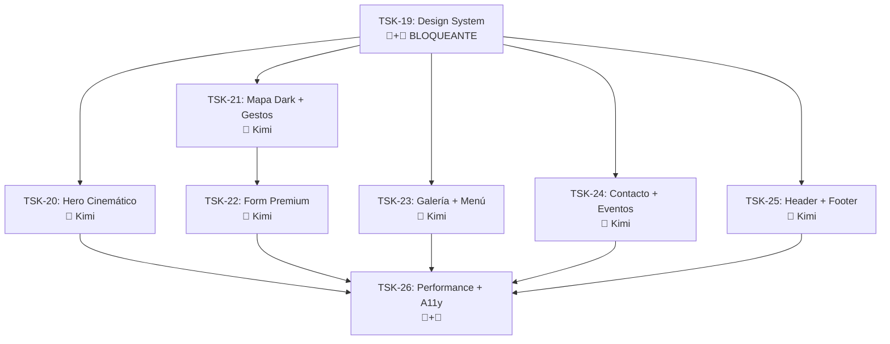

# Sprint 4 — Rediseño Premium Full Site · Pachanga y Pochola

## Épica
**Experiencia Digital Premium** — Transformar todo el frontend en una experiencia inmersiva de sitio de nightclub de clase mundial: dark theme glass, parallax cinemático, gestos táctiles, micro-animaciones y mobile-first extremo.

---

## Filosofía de Diseño

> **Referencia visual:** Sitios premium de nightclubs como Berghain, LIV Miami, Hakkasan — dark, inmersivo, cinematográfico.

| Principio | Implementación |
|---|---|
| **Dark Luxury** | Fondo `#0a0a0a`, cards glassmorphism `bg-white/5 backdrop-blur-xl border-white/10` |
| **Gold & Fire** | Acentos `#FFD700` (dorado) y `#E31B23` (rojo fuego) sobre negro |
| **Movement** | Todo elemento visible tiene micro-animación (Framer Motion) |
| **Mobile-Only Mindset** | Diseñar para 375px primero, escalar hacia arriba |
| **Cinematic** | Hero con video/parallax, transiciones entre páginas cinematográficas |
| **Touch-First** | Targets 48px mínimo, swipe gestures, feedback háptico |

---

## Historias de Usuario

### TSK-19: Design System Tokenizado

- **Asignación:** 🤖 Antigravity + 🎨 Kimi
- **Prioridad:** 🔴 Bloqueante — todo depende de esto

```
Given el sitio tiene colores hardcodeados en cada componente (#0a0a0a, #1a1a1a, etc.)
When se crea un Design System centralizado con CSS custom properties
Then TODOS los componentes consumen tokens, no hex literals
And cambiar la paleta entera requiere editar 1 solo archivo
And se incluye tipografía, spacing, radii, shadows, y animaciones
```

**Archivos:**

| Acción | Archivo | Descripción |
|---|---|---|
| NEW | `styles/design-tokens.css` | Tokens CSS: `--color-bg`, `--color-surface`, `--color-glass`, `--color-accent-gold`, etc. |
| NEW | `styles/glass.css` | Utilidades glassmorphism: `.glass-card`, `.glass-nav`, `.glass-modal` |
| MODIFY | `index.css` | Importar tokens + glass utilities |
| NEW | `lib/motion.ts` | Configuraciones de Framer Motion reutilizables: `fadeInUp`, `staggerConfig`, `springConfig` |

**Tokens propuestos:**

```css
:root {
  /* Surface */
  --bg-void: #050505;
  --bg-base: #0a0a0a;
  --bg-surface: #111111;
  --bg-elevated: #1a1a1a;

  /* Glass */
  --glass-bg: rgba(255,255,255,0.03);
  --glass-border: rgba(255,255,255,0.08);
  --glass-blur: 20px;

  /* Accent */
  --accent-gold: #FFD700;
  --accent-red: #E31B23;
  --accent-red-glow: rgba(227,27,35,0.25);

  /* Text */
  --text-primary: rgba(255,255,255,0.95);
  --text-secondary: rgba(255,255,255,0.60);
  --text-muted: rgba(255,255,255,0.35);

  /* Spacing (4px base) */
  --space-1: 4px; --space-2: 8px; --space-4: 16px;
  --space-6: 24px; --space-8: 32px; --space-12: 48px;

  /* Animation */
  --ease-out-expo: cubic-bezier(0.16, 1, 0.3, 1);
  --duration-fast: 200ms;
  --duration-normal: 400ms;
  --duration-slow: 800ms;
}
```

---

### TSK-20: Hero Cinemático con Video Parallax

- **Asignación:** 🎨 Kimi Code
- **Prioridad:** 🟠 Alta
- **Depende de:** TSK-19

```
Given el usuario abre la página principal en mobile
When la página carga
Then ve un hero fullscreen con video looping de la rumba salsera (o fallback imagen)
And el texto "PACHANGA Y POCHOLA" aparece con typewriter effect
And al hacer scroll down, el hero hace parallax fade-out con blur
And hay un CTA "RESERVAR AHORA" pulsante que lleva a /reservas
And el CTA de abajo (L245) también apunta a /reservas
```

**Mejoras premium al HeroSection actual:**

| Feature actual | Upgrade premium |
|---|---|
| Imagen estática + particles CSS | Video loop MP4/WebM + partículas con Canvas |
| Typewriter básico | Typewriter con cursor pulsante estilo terminal |
| Parallax con `useTransform` | Parallax + blur + desaturación al scroll |
| CTA estático | CTA con pulse animation + glow ring |

**Archivos:**

| Acción | Archivo |
|---|---|
| MODIFY | [sections/HeroSection.tsx](file:///c:/Users/LENOVO%20CORP/Proyecto%20Pachanga/app/src/sections/HeroSection.tsx) |
| MODIFY | [pages/HomePage.tsx](file:///c:/Users/LENOVO%20CORP/Proyecto%20Pachanga/app/src/pages/HomePage.tsx) — CTA L245 → `/reservas` |
| NEW | `public/hero-video.mp4` (usuario provee) o usar fallback imagen |

---

### TSK-21: Mapa Interactivo Dark + Gestos Táctiles

- **Asignación:** 🎨 Kimi Code
- **Prioridad:** 🟠 Alta
- **Depende de:** TSK-19

```
Given la VisualTableMap actualmente tiene fondo claro (amber-50)
When se aplica el Design System
Then el mapa tiene fondo --bg-surface con gradiente radial sutil
And las mesas brillan con glow suave (box-shadow accent-red)
And la TARIMA tiene efecto glassmorphism
And en mobile, el usuario puede hacer swipe para cambiar de piso
And en mobile, puede hacer pinch-to-zoom en el mapa
And al tocar una mesa, hay pulse animation + haptic feedback
And el tooltip tiene glassmorphism (--glass-bg)
```

**Archivos:**

| Acción | Archivo |
|---|---|
| MODIFY | [components/reservas/VisualTableMap.tsx](file:///c:/Users/LENOVO%20CORP/Proyecto%20Pachanga/app/src/components/reservas/VisualTableMap.tsx) — dark theme + glow + gestos |
| MODIFY | [components/reservas/TableMap.tsx](file:///c:/Users/LENOVO%20CORP/Proyecto%20Pachanga/app/src/components/reservas/TableMap.tsx) — dark wrapper + glass card |
| MODIFY | [components/reservas/FloorTabs.tsx](file:///c:/Users/LENOVO%20CORP/Proyecto%20Pachanga/app/src/components/reservas/FloorTabs.tsx) — dark glass tabs |
| MODIFY | [components/reservas/TableTooltip.tsx](file:///c:/Users/LENOVO%20CORP/Proyecto%20Pachanga/app/src/components/reservas/TableTooltip.tsx) — glassmorphism |
| NEW | dependencia `@use-gesture/react` |

---

### TSK-22: Formulario Reserva Premium (Stepper + Modal Glass)

- **Asignación:** 🎨 Kimi Code
- **Prioridad:** 🟠 Alta
- **Depende de:** TSK-19, TSK-21

```
Given el cliente está en mobile (< 768px)
When llega al formulario
Then ve un stepper de 3 pasos con progress bar animada:
  1. "¿Cuándo vienes?" → fecha + hora + personas
  2. "Elige tu mesa" → mapa interactivo
  3. "Tus datos" → nombre, teléfono, mensaje → enviar

Given la reserva es exitosa
When el servidor responde 201
Then aparece modal fullscreen con glassmorphism:
  - Confetti animation
  - Datos de la reserva (mesa, fecha, hora)
  - "Te contactaremos para confirmar"
  - Botón "Hacer otra reserva" + "Volver al inicio"
```

**Archivos:**

| Acción | Archivo |
|---|---|
| MODIFY | [components/reservas/ReservationForm.tsx](file:///c:/Users/LENOVO%20CORP/Proyecto%20Pachanga/app/src/components/reservas/ReservationForm.tsx) — dark inputs + glass card |
| NEW | `components/reservas/MobileReservationStepper.tsx` |
| NEW | `components/reservas/ReservationSuccessModal.tsx` — glassmorphism + confetti |
| MODIFY | [pages/ReservasPage.tsx](file:///c:/Users/LENOVO%20CORP/Proyecto%20Pachanga/app/src/pages/ReservasPage.tsx) — dark theme + responsive layout |

---

### TSK-23: Galería Inmersiva + Menú Premium

- **Asignación:** 🎨 Kimi Code
- **Prioridad:** 🟡 Media
- **Depende de:** TSK-19

```
Given el usuario navega a /galeria
When la página carga
Then ve un grid masonry con imágenes que aparecen con stagger animation
And al hacer click en una imagen, se abre un lightbox fullscreen con gestos swipe
And el lightbox tiene glassmorphism controls (flechas, cerrar, contador)
And en mobile, puede hacer swipe left/right para navegar entre fotos

Given el usuario navega a /menu
When la página carga
Then ve las categorías como tabs con glass style
And cada item del menú tiene animación fadeInUp stagger
And items populares tienen badge "Popular" con glow dorado
And los precios tienen font-heading con efecto gradient gold
```

**Archivos:**

| Acción | Archivo |
|---|---|
| MODIFY | [pages/GaleriaPage.tsx](file:///c:/Users/LENOVO%20CORP/Proyecto%20Pachanga/app/src/pages/GaleriaPage.tsx) — masonry grid + glass lightbox + swipe gestures |
| MODIFY | [pages/MenuPage.tsx](file:///c:/Users/LENOVO%20CORP/Proyecto%20Pachanga/app/src/pages/MenuPage.tsx) — glass tabs + premium cards + gold prices |

---

### TSK-24: Contacto y Eventos Premium

- **Asignación:** 🎨 Kimi Code
- **Prioridad:** 🟡 Media
- **Depende de:** TSK-19

```
Given el ContactoPage actual tiene un formulario de reserva duplicado
When se rediseña
Then el formulario de reserva se ELIMINA de ContactoPage
And se reemplaza por un CTA prominente "RESERVAR MESA →" que va a /reservas
And la info de contacto se presenta en cards glassmorphism con íconos animados
And se agrega Google Maps embed con style dark mode
And se corrige la dirección del mail (reservas@ → info@)

Given el EventosPage se rediseña
When se aplica el Design System
Then el evento featured tiene diseño hero con imagen fullbleed
And los servicios se muestran en cards glass con hover reveal
And hay CTA "Reservar para este evento" que lleva a /reservas
```

**Archivos:**

| Acción | Archivo |
|---|---|
| MODIFY | [pages/ContactoPage.tsx](file:///c:/Users/LENOVO%20CORP/Proyecto%20Pachanga/app/src/pages/ContactoPage.tsx) — eliminar form reserva, glass cards, dark map |
| MODIFY | [pages/EventosPage.tsx](file:///c:/Users/LENOVO%20CORP/Proyecto%20Pachanga/app/src/pages/EventosPage.tsx) — hero evento, glass service cards |
| MODIFY | [sections/ReservasSection.tsx](file:///c:/Users/LENOVO%20CORP/Proyecto%20Pachanga/app/src/sections/ReservasSection.tsx) — eliminar o redirigir a /reservas |

---

### TSK-25: Header Glassmorphism + Footer Unificado

- **Asignación:** 🎨 Kimi Code
- **Prioridad:** 🟡 Media
- **Depende de:** TSK-19

```
Given el Header actual usa bg-[#0a0a0a]/95 backdrop-blur-xl
When se aplica glassmorphism premium
Then usa --glass-bg con backdrop-blur-2xl
And el underline animado de los links activos tiene glow effect
And el botón mobile tiene animación hamburger → X con spring
And "RESERVAR AHORA" tiene pulse glow permanente

Given el Footer no incluye link a /reservas
When se actualiza
Then agrega "Reservas" al array de navegación
And el copyright dice 2026 (no 2025)
And el link "Admin" NO es visible en producción (condicionado a NODE_ENV)
```

**Archivos:**

| Acción | Archivo |
|---|---|
| MODIFY | [components/Header.tsx](file:///c:/Users/LENOVO%20CORP/Proyecto%20Pachanga/app/src/components/Header.tsx) — glass nav + glow links + pulse CTA |
| MODIFY | [layouts/Footer.tsx](file:///c:/Users/LENOVO%20CORP/Proyecto%20Pachanga/app/src/layouts/Footer.tsx) — agregar Reservas, copyright 2026, ocultar Admin |

---

### TSK-26: Performance + Accesibilidad + SEO

- **Asignación:** 🤖 Antigravity (config) + 🎨 Kimi (implementación)
- **Prioridad:** 🟢 Normal (pero obligatorio antes de deploy)
- **Depende de:** TSK-20 a TSK-25

```
Given todo el rediseño está implementado
When se ejecuta Lighthouse en modo mobile
Then Performance ≥ 85 (LCP < 2.5s, INP < 200ms, CLS < 0.1)
And Accessibility ≥ 95 (WCAG 2.1 AA)
And SEO ≥ 95
And Best Practices ≥ 90

Given las imágenes del sitio
When se optimizan
Then se convierten a WebP/AVIF con lazy-loading
And el hero video tiene poster image para LCP rápido
And las fonts se cargan con font-display: swap
```

**Archivos:**

| Acción | Archivo |
|---|---|
| MODIFY | [index.html](file:///c:/Users/LENOVO%20CORP/Proyecto%20Pachanga/app/index.html) — meta tags, preconnect, preload fonts |
| CONFIG | [vite.config.ts](file:///c:/Users/LENOVO%20CORP/Proyecto%20Pachanga/app/vite.config.ts) — plugin de compresión de imágenes |
| MODIFY | Todas las páginas — `loading="lazy"` en imágenes below-fold |

---

## Dependencias



## Orden de Ejecución Recomendado

| Prioridad | Tarea | Días est. |
|:---:|---|:---:|
| 1️⃣ | **TSK-19** Design System (bloqueante) | 1 |
| 2️⃣ | **TSK-25** Header + Footer (afecta todas las páginas) | 0.5 |
| 3️⃣ | **TSK-20** Hero cinemático | 1 |
| 4️⃣ | **TSK-21** Mapa dark + gestos | 1 |
| 5️⃣ | **TSK-22** Form premium + stepper + modal | 1 |
| 6️⃣ | **TSK-23** + **TSK-24** (paralelo) Galería/Menú + Contacto/Eventos | 1.5 |
| 7️⃣ | **TSK-26** Performance + A11y | 0.5 |
| | **Total estimado** | **~6.5 días** |
