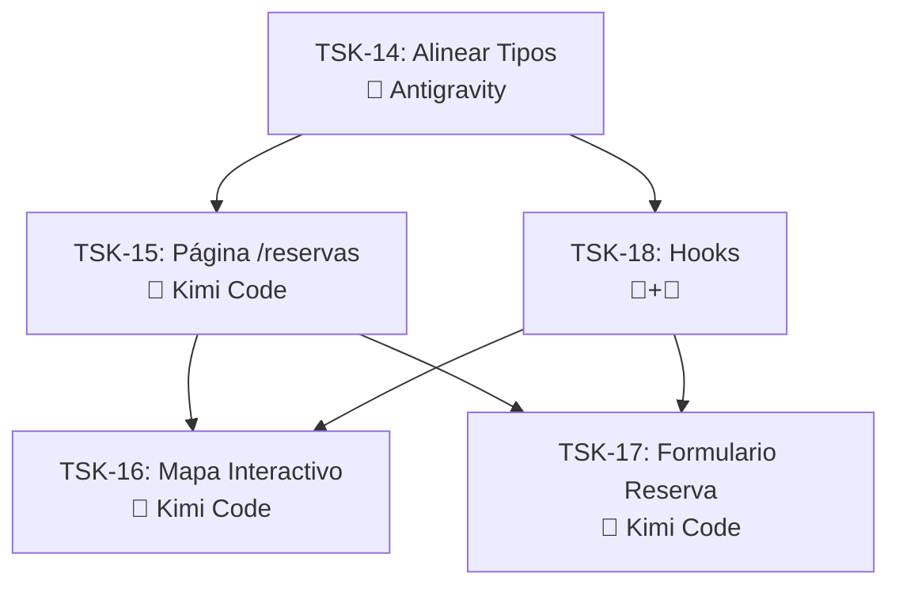

# Sprint 3 — Mapa Interactivo de Mesas + Reservas Públicas

## Épica
**Reserva Interactiva de Mesas** — El cliente puede ver el mapa de mesas del local por piso, seleccionar una mesa disponible y completar una reserva en tiempo real.

---

## User Review Required

> [!CAUTION]
> **Desalineación de Tipos Frontend ↔ Backend.** Los tipos en [reservation.types.ts](file:///c:/Users/LENOVO%20CORP/Proyecto%20Pachanga/app/src/types/reservation.types.ts) usan nombres en español (`nombre`, `celular`, `fecha`, `mesaAsignada`) que **NO** coinciden con los contratos del backend (`customerName`, `customerPhone`, `reservationDate`, `tableId`). TSK-14 corrige esto antes de que cualquier otra tarea pueda funcionar.

> [!IMPORTANT]
> **Separación de Poderes.** Este plan genera los **tipos, servicios e interfaces de datos** (Antigravity). Kimi Code implementa los **componentes visuales y la UI**. El plan indica claramente qué hace cada uno.

---

## Historias de Usuario

### TSK-14: Alinear Tipos Frontend con Contratos Backend
- **Asignación:** 🤖 Antigravity Core (Backend/Tipos)
- **Prioridad:** 🔴 Bloqueante

**Criterios de Aceptación:**
```
Given los tipos en `reservation.types.ts` usan nomenclatura en español
When se actualizan para coincidir con el backend
Then los campos son: customerName, customerPhone, reservationDate, reservationTime, partySize, tableId, message, status
And se crea `table.types.ts` con los tipos del mapa
And se actualiza `reservation.service.ts` para usar los nombres correctos de la API
```

**Archivos a modificar/crear:**

#### [MODIFY] [reservation.types.ts](file:///c:/Users/LENOVO%20CORP/Proyecto%20Pachanga/app/src/types/reservation.types.ts)
```diff
-export interface Reservation {
-  nombre: string;
-  celular: string;
-  fecha: string;
-  numeroPersonas: number;
-  mesaAsignada?: string;
-  estado: 'pendiente' | 'confirmada' | 'cancelada' | 'completada';
+export interface Reservation {
+  id: string;
+  customerName: string;
+  customerPhone: string;
+  reservationDate: string;
+  reservationTime: string;
+  partySize: number;
+  tableId: string | null;
+  message?: string;
+  status: 'PENDING' | 'CONFIRMED' | 'CANCELLED' | 'COMPLETED';
+  table: TableSummary | null;
+  createdAt: string;
+  updatedAt: string;
```

#### [NEW] [table.types.ts](file:///c:/Users/LENOVO%20CORP/Proyecto%20Pachanga/app/src/types/table.types.ts)
```typescript
export interface TableSummary {
  id: string;
  name: string;
  capacity: number;
  zone: 'SALON' | 'BARRA';
  floor: number;
  isAvailable: boolean;
}

export interface FloorMap {
  label: string;
  tables: TableSummary[];
}

export interface TableMapResponse {
  floor1: FloorMap;
  floor2: FloorMap;
  totalTables: number;
  availableTables: number;
}
```

#### [NEW] [table.service.ts](file:///c:/Users/LENOVO%20CORP/Proyecto%20Pachanga/app/src/services/table.service.ts)
```typescript
// Consume: GET /api/tables/map?date=YYYY-MM-DD&time=HH:MM
// Response: { data: TableMapResponse }
```

#### [MODIFY] [reservation.service.ts](file:///c:/Users/LENOVO%20CORP/Proyecto%20Pachanga/app/src/services/reservation.service.ts)
- Actualizar params a nombres del backend ([date](file:///c:/Users/LENOVO%20CORP/Proyecto%20Pachanga/backend/src/modules/tables/table.controller.ts#62-71), `status`, `page`, `limit`)
- Actualizar [CreateReservationDTO](file:///c:/Users/LENOVO%20CORP/Proyecto%20Pachanga/app/src/types/reservation.types.ts#14-21) a los campos correctos

---

### TSK-15: Página Pública de Reservas con Mapa
- **Asignación:** 🎨 Kimi Code (Frontend UI)
- **Prioridad:** 🟠 Alta
- **Depende de:** TSK-14

**Criterios de Aceptación:**
```
Given un cliente visita /reservas
When la página carga
Then ve el mapa de mesas dividido en 2 pisos (tabs)
And las mesas disponibles se muestran en color
And las mesas ocupadas se muestran en gris/deshabilitadas
And hay un formulario de reserva al lado del mapa
```

**Archivos a crear:**

#### [NEW] [ReservasPage.tsx](file:///c:/Users/LENOVO%20CORP/Proyecto%20Pachanga/app/src/pages/ReservasPage.tsx)
- Layout: mapa (izquierda/arriba) + formulario (derecha/abajo)
- Recibe [date](file:///c:/Users/LENOVO%20CORP/Proyecto%20Pachanga/backend/src/modules/tables/table.controller.ts#62-71) y `time` del formulario y recarga el mapa
- Mobile-first: mapa arriba, formulario abajo

#### [MODIFY] [router/index.tsx](file:///c:/Users/LENOVO%20CORP/Proyecto%20Pachanga/app/src/router/index.tsx)
```diff
+ import { ReservasPage } from '@/pages/ReservasPage';
  // En children del PublicLayout:
+ { path: 'reservas', element: <ReservasPage /> },
```

**Contrato de API que consume:**
```
GET /api/tables/map?date=2026-03-01&time=20:00
→ { data: { floor1: {...}, floor2: {...}, totalTables: 83, availableTables: 70 } }
```

---

### TSK-16: Componente Mapa Interactivo de Mesas
- **Asignación:** 🎨 Kimi Code (Frontend UI)
- **Prioridad:** 🟠 Alta
- **Depende de:** TSK-14, TSK-15

**Criterios de Aceptación:**
```
Given el mapa muestra las mesas del piso seleccionado
When el cliente hace click en una mesa disponible
Then aparece un tooltip con: nombre, capacidad, zona
And la mesa se selecciona visualmente (borde highlight)
And el tableId se pasa al formulario de reserva

Given una mesa está ocupada
When el cliente intenta clickearla
Then la mesa está deshabilitada y en gris
And no se puede seleccionar
```

**Archivos a crear:**

#### [NEW] [components/reservas/TableMap.tsx](file:///c:/Users/LENOVO%20CORP/Proyecto%20Pachanga/app/src/components/reservas/TableMap.tsx)
- Props: `floorData: FloorMap`, `selectedTableId: string | null`, `onSelectTable: (id: string) => void`
- Renderiza mesas como elementos interactivos posicionados
- Colores por tipo de mesa:

| Prefijo | Color | Forma |
|---|---|---|
| P (1-21) | Verde/teal | Rectángulo grande |
| V (1-35) | Dorado/marrón | Círculo mediano |
| R (1-2) | Dorado/marrón | Círculo mediano |
| Letra (A-Z) | Dorado oscuro | Círculo pequeño |

#### [NEW] [components/reservas/FloorTabs.tsx](file:///c:/Users/LENOVO%20CORP/Proyecto%20Pachanga/app/src/components/reservas/FloorTabs.tsx)
- Tabs para "Primer Piso" / "Segundo Piso"
- Muestra contador de mesas disponibles por piso

#### [NEW] [components/reservas/TableTooltip.tsx](file:///c:/Users/LENOVO%20CORP/Proyecto%20Pachanga/app/src/components/reservas/TableTooltip.tsx)
- Muestra nombre, capacidad, zona de la mesa seleccionada

**Imagen de referencia:** [mapa_mesas_recortado.jpg](file:///c:/Users/LENOVO%20CORP/Proyecto%20Pachanga/Material%20audiovisual/mapa_mesas_recortado.jpg)

---

### TSK-17: Formulario de Reserva Público
- **Asignación:** 🎨 Kimi Code (Frontend UI)
- **Prioridad:** 🟠 Alta
- **Depende de:** TSK-14, TSK-15

**Criterios de Aceptación:**
```
Given el cliente llena el formulario con datos válidos y mesa seleccionada
When hace click en "Reservar"
Then se envía POST /api/reservations con todos los campos
And si retorna 201 → muestra confirmación con datos de la reserva
And si retorna 409 → muestra "Mesa ya reservada" y recarga el mapa
And si retorna 429 → muestra "Demasiadas reservas, intente más tarde"
And si retorna 400 → muestra mensaje de error del backend

Given el cliente NO selecciona una mesa
When intenta reservar
Then el formulario permite enviar sin mesa (reserva sin asignación)
```

**Archivos a crear:**

#### [NEW] [components/reservas/ReservationForm.tsx](file:///c:/Users/LENOVO%20CORP/Proyecto%20Pachanga/app/src/components/reservas/ReservationForm.tsx)
- Campos: nombre, teléfono, fecha, hora, personas, mensaje (opcional)
- Recibe `selectedTableId` como prop
- Validación client-side con React Hook Form + Zod (opcional)
- Loading state con spinner durante submit

**Contrato:**
```json
POST /api/reservations
{
  "customerName": "Juan Pérez",
  "customerPhone": "555-0101",
  "reservationDate": "2026-03-01",
  "reservationTime": "20:00",
  "partySize": 4,
  "tableId": "uuid",
  "message": "Cumpleaños"
}
// 201 → { data: Reservation }
// 409 → { error: "Esta mesa ya está reservada..." }
// 429 → { error: "Demasiadas reservas..." }
// 400 → { error: "No se pueden crear reservas para fechas pasadas" }
```

---

### TSK-18: Hook `useTableMap` + Integración
- **Asignación:** 🤖 Antigravity Core (datos) + 🎨 Kimi Code (integración)
- **Prioridad:** 🟡 Media
- **Depende de:** TSK-14

**Criterios de Aceptación:**
```
Given el hook useTableMap recibe date y time
When ejecuta la query
Then retorna el FloorMap con estado de loading/error
And refresca automáticamente cuando cambian date/time
And invalida la cache tras una reserva exitosa
```

**Archivos a crear:**

#### [NEW] [hooks/useTableMap.ts](file:///c:/Users/LENOVO%20CORP/Proyecto%20Pachanga/app/src/hooks/useTableMap.ts)
```typescript
// React Query hook que consume tableService.getMap(date, time)
// Keys: ['table-map', date, time]
// Invalidate on: mutation success de reservationService.create
```

#### [NEW] [hooks/useCreateReservation.ts](file:///c:/Users/LENOVO%20CORP/Proyecto%20Pachanga/app/src/hooks/useCreateReservation.ts)
```typescript
// React Query mutation que consume reservationService.create
// onSuccess: invalidate ['table-map'] + mostrar notificación
// onError: manejar 409, 429, 400
```

---

## Dependencias



> [!IMPORTANT]
> **Orden de ejecución:**
> 1. **TSK-14** (Antigravity) — bloqueante, todo depende de esto
> 2. **TSK-18** (Antigravity + Kimi) — hooks de datos
> 3. **TSK-15** (Kimi) — página contenedora
> 4. **TSK-16 + TSK-17** (Kimi) — componentes en paralelo

---

## Verificación

### Criterio de Éxito
- [ ] Ruta `/reservas` accesible desde navegación
- [ ] Mapa muestra 83 mesas divididas en 2 pisos
- [ ] Mesas disponibles clickeables, ocupadas deshabilitadas
- [ ] Formulario envía reserva y muestra confirmación
- [ ] Errores 409/429/400 se muestran al usuario
- [ ] Tras reserva exitosa, mapa se refresca automáticamente
